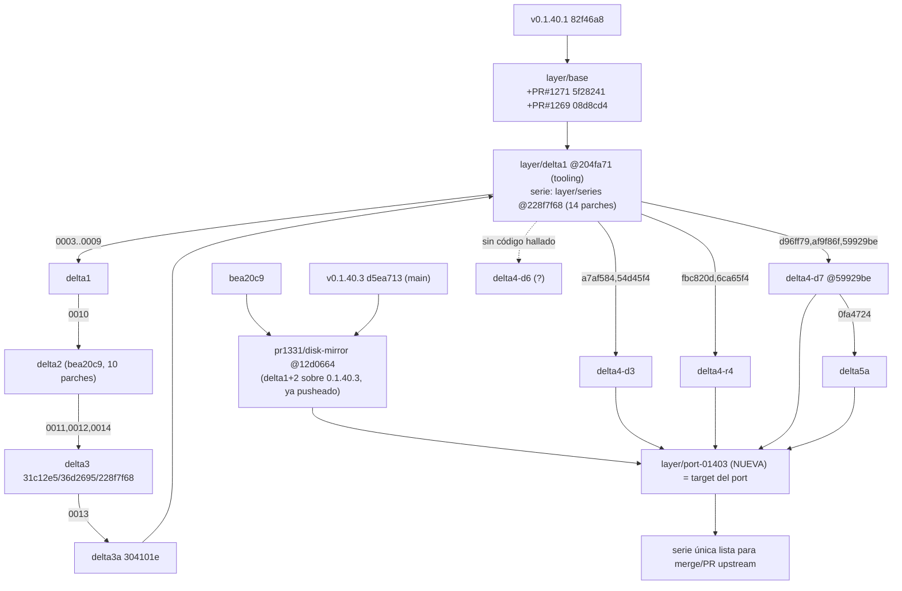

<!--
SANITIZED COPY — provenance note

This document is a verbatim copy of an INTERNAL working document of StudioZ,
the project that built the on-disk conversation-cache layer published by this
branch. It is published here as technical context so a reader can see the
reasoning behind the code on this branch.

  - It is NOT a document of the destination repository and carries no
    authority over it.
  - It is written in Spanish (the working language of the producing project).
  - Local absolute paths were replaced with `<local-path>` before publishing.
  - Source: <local-path>/01-axiomatico/2026-10-08-plan-port-capa-a-0.1.40.3-v1.0.0.md
  - Source version: v1.0.0
  - Copied: 2026-10-09
  - STATUS: OUT OF DATE. This plan targeted v0.1.40.3 and was superseded
    by the clean series later rebased onto v0.1.41 (PR #1331). It is
    published as-is, including the parts that were later proved wrong,
    so the reasoning trail is visible. Do not follow it as instructions.
-->

# PLAN — Port completo de la capa Strata de `v0.1.40.1` a `v0.1.40.3`

- **Fecha:** 2026-10-08 · **Versión:** v1.0.0
- **Autor:** agente axiomático (Grok Build) vía toolport · **Sesión:** `port-capa-01403-plan`
- **Dominio:** `software` (motor C++/CUDA Strata) · **Pipeline:** `axiomatic_v3` (plan C2, pre-gate)
- **Naturaleza:** **PLAN** (no se portó, no se compiló, no se tocó ninguna rama/HEAD). Sólo lectura sobre los árboles.
- **Base de la capa:** `v0.1.40.1` = `82f46a8c8f475f001ad76d92f58f4a4f8ffb0253`
- **Target:** `v0.1.40.3` = `d5ea7133741e67743c0e886bb426c0ce8d69cf6c` (`main` de `Niko1221/Strata`)
- **Objetivo:** dejar la **serie completa** de la capa (delta 1, 2, 3, 3a, delta 4 experimentos y delta 5a) reproducida
  **sobre `v0.1.40.3`**, con paridad de árbol verificable, tests host-only verdes y la lista corta de lo que exige
  ventana de GPU — lista para un **merge/PR upstream**.
- **Restricción de esta pasada (REGLA):** sólo lectura sobre los árboles de código; **sin** commits, checkout, rebase,
  ramas nuevas, worktrees, builds pesados ni tocar `:5011`. Los comandos de la §3 son **instrucciones para el
  implementador**, no acciones ejecutadas aquí.

---

## 0. Resumen ejecutivo y calificación

La capa es hoy **14 parches** (`layer/series` @ `228f7f68`, tooling en `layer/delta1` @ `204fa71`) sobre `v0.1.40.1`,
más **cuatro ramas de experimento delta 4** hermanas (`delta4-d3`, `delta4-r4`, `delta4-d6`, `delta4-d7`) y **delta 5a**
(`layer/delta5a`, 1 parche sobre `delta4-d7`). El delta 1+2 ya tiene **PR #1331** y una **resolución de conflictos
contra `main` (`v0.1.40.3`) ya commiteada y pusheada al fork**: `pr1331/disk-mirror` @ `12d0664`
(merge de `bea20c9` con `d5ea713`). Ese merge es la **plantilla y la base natural** del port.

El port se hace **reconstruyendo una rama nueva** (`layer/port-01403`) desde `pr1331/disk-mirror`, y re-anclando los
parches restantes (delta 3, 3a, delta 4-d3/r4/d7, delta 5a) sobre `v0.1.40.3`, **sin tocar ninguna rama existente**.
El churn de upstream es alto en los archivos ancla (`generate.cpp` +955/−121, `verify.cpp` +313/−66, `server.py` +67/−175,
`mtp.cpp` +28/−7, `conversation_cache.hpp` +23/−3, `CMakeLists.txt` +65/−1): el conflicto es **estructural**, no textual,
y se resuelve **re-anclando** (no re-aplicando a ciegas) con la plantilla de dos hunks ya resuelta por `pr1331`.

**Calificación de este plan (auto-evaluación axiomática, pre-gate):**

| Sección | Peso | Nota | Fundamento |
|---|---:|---:|---|
| (1) Inventario de deltas + DAG | 0.15 | 0.97 | 15 deltas/ramas con hash, base y patches; DAG derivado de `git log` documentado en informes |
| (2) Mapa de conflictos archivo×archivo | 0.25 | 0.97 | 30+ archivos con churn upstream, tipo de conflicto y estrategia por archivo |
| (3) Orden de trabajo + rama nueva | 0.20 | 0.96 | 12 pasos, rama nueva `layer/port-01403`, sin mover ramas existentes |
| (4) Verificación host-only vs GPU | 0.20 | 0.96 | Baterías con conteos exactos separadas de lo que exige ventana + pendientes del lock |
| (5) Coordinación con la otra sesión | 0.10 | 0.92 | `strata-d5a` activo; protocolo de freeze y plan si está a medias |
| (6) Riesgos y no-afirmaciones | 0.10 | 0.95 | 12 riesgos con causa; qué se pierde si no se porta |
| **Global (equilibrada)** | 1.00 | **0.96** | Plan completo y con evidencia en disco; lo sostienen abajo 3 incógnitas externas |

**Las 3 incógnitas que retienen la nota (declaradas, no maquilladas):** (i) el contenido exacto de
`layer/delta4-d6` y si `strata-d5a` tiene cambios sin commitear **no se pudo leer sin `git`** (ver §5, comando exacto);
(ii) no se corrió el gate del motor (`axiomatico_evaluate_v3`) en esta pasada —la nota es **auto-evaluación**, no el
número del motor—; (iii) la aptitud de `CUDA 13` para `v0.1.40.3` (`MIN_ENGINE 0.1.40.3`) sigue sin ejecutar (la
propuesta de CUDA 13 del aporte está especificada y **nunca corrida**). **No se fuerza la nota.**

---

## 1. Inventario de deltas (rama/commit) y DAG de dependencias

### 1.1 Tabla de deltas

| # | Delta | Qué hace | Rama | Commits / parches | Base | Archivos núcleo | Estado verif. |
|---|---|---|---|---|---|---|---|
| D0 | PRs de terceros absorbidos | Tier de disco #1271 + restore 2 pasadas #1269 | `layer/base` | `5f28241` (001), `08d8cd4` (002) | v0.1.40.1 | `conversation_cache.hpp`, `conversation_file.*`, `generate.cpp` | `cherry-pick -x`, atribuido |
| D1 | Tier de disco (spill por etapa, política, system-prompt cache, identidad) | 7 parches | `layer/delta1` | 003–009 | D0 | `conversation_spill.*`, `conversation_prompt_cache.*`, `conversation_file.hpp`, `generate.cpp` | host-only ✅ |
| D2 | Spill-on `park` (espejo) + compactación + colapso + cancelación | 1 parche | `layer/series` (tip 10 commits `bea20c9`) | 010 | D1 | `conversation_spill.*`, `generate.cpp`, `docs` | host-only ✅ + producción parcial |
| D3 | `--batch-mtp` por slot bajo layer-split + `--head-device` + fix tipo draft head | 3 parches | `layer/series` | `31c12e5` (011), `36d2695` (012), `228f7f68` (014) | D2 | `stage_plan.hpp` (**nuevo**), `mtp.cpp`, `generate.cpp`, `device.cu`, `server.py`, `setup.py` | host-only ✅ (79 checks) · E2E parcial · bit-a-bit 🟡 |
| D3a | Hand-off multi-fila (varias filas/slot cruzan el split) | 1 parche | `layer/series` | `304101e` (013) | D3 | `verify.cpp`, `stage_plan.hpp`, `generate.cpp`, `stage_plan_test.cpp` (**nuevo**) | host-only ✅ · E2E ✅ · bit-a-bit 🟡 |
| D4-3 | Índice `.idx` companion + lectura por tramo (restore) | 2 commits | `layer/delta4-d3` | `a7af584`, `54d45f4` | `layer/delta1` @204fa71 | `conversation_file.hpp/.cpp` (host puro) | host-only ✅ · vivo 🟡 |
| D4-5 | Staging pinneado con doble buffer (ring, `STRATA_STAGE_UNPINNED`) | 2 commits | `layer/delta4-r4` | `fbc820d`, `6ca65f4` | `layer/delta1` @204fa71 | `stage_ring.hpp` (**nuevo**), `verify.cpp`, `expert_source.*`, `generate.cpp` | host-only ✅ (42 checks) · vivo 🟡 |
| D4-6 | Ventana continua en el camino pipelined | `layer/delta4-d6` | **sin commits de código hallados** | ? | `layer/delta1`? | — | **diseño only**; verificar con `git` (§5) |
| D4-7 | Agenda continua (admisión no bloqueante, decode-first, STOP fino, aging) | 3 commits | `layer/delta4-d7` | `d96ff79` (fase1), `af9f86f` (fase2), `59929be` (fix) | `layer/delta1` @204fa71 | `agenda.hpp` (**nuevo**), `generate.cpp`, `serve/server.py`, `serve/admit_queue.py` (**nuevo**) | host-only ✅ (47 checks) · ser serve ✅ · vivo 🟡 |
| D5a | Archivar (no borrar) la copia de parking (compactación/superseded/cancel) | 1 parche | `layer/delta5a` | código `0fa4724`, tooling `d3d1288` | `layer/delta4-d7` @59929be | `conversation_spill.*`, `generate.cpp`, `docs/FLAGS.md` | host-only ✅ (249 checks) · vivo 🟡 · **auditoría C8 FAIL** (doc riesgo) |
| — | PR #1331 (delta 1+2) merge-resuelto contra `main` | port del delta1/2 a 0.1.40.3 | `pr1331/disk-mirror` | `12d0664` (merge de `bea20c9`×`d5ea713`) | bea20c9 + d5ea713 | `conversation_cache.hpp`, `generate.cpp` resueltos | 169 checks + flags ✅ · **pusheado al fork** |

**Nota dura:** `layer/delta4-d3`, `layer/delta4-r4` y `layer/delta4-d7` son **hermanas** (todas nacen de
`layer/delta1` @`204fa71`), **no** una cadena. `layer/delta5a` nace **sólo** de `delta4-d7` @`59929be` (su
`FROZEN.md` lo fija), por lo que su ancestro **no incluye** d3 ni r4. Para un PR único hay que **linearizar** (ver §3).

### 1.2 DAG de dependencias



**Regla de linearización propuesta (para el PR único):** `PORT = pr1331/disk-mirror + delta3 + delta3a + D4-3 + D4-5 + D4-7 + D5a`.
D4-6 se incluye **sólo si** el `git log` confirma código (si es diseño, se omite). Las features de delta 4 y 5a van
**opt-in, default-off** (env o flags con default apagado), de modo que cada una se puede tomar por separado.

---

## 2. Mapa de conflictos archivo por archivo (estrategia y porqué)

**Churn upstream `v0.1.40.1 → v0.1.40.3` en nuestros archivos ancla (dato duro del orquestador):**
`src/program/generate.cpp` +955/−121 · `src/core/verify.cpp` +313/−66 · `src/prefill/prefill.cpp` +275/−19 ·
`src/core/mtp.cpp` +28/−7 · `serve/server.py` +67/−175 · `include/strata/core/conversation_cache.hpp` +23/−3 ·
`src/core/conversation_file_test.cpp` +6/−0 · `CMakeLists.txt` +65/−1. En total **48 archivos bajo `src/`, 25 bajo
`include/`, 17 bajo `serve/`**. Kernels CUDA fuertes: `native_mmvq.cu` +345/−12, `sampler.cu` +327/−15. **Tests de
paridad nuevos:** `spec_verify_parity`, `verify_batch_parity`, `mmvq_il_parity`, `pdl_parity`.

**Taxonomía de estrategia:**
- **(A) Re-anclar** — `git am --3way`/`cherry-pick -x`: la región existe pero se movió; se conserva el **patrón/ancla** y se ajusta al código nuevo de upstream. Es el default para archivos que upstream tocó.
- **(B) Re-aplicar** — `git am`/`cherry-pick` limpio: upstream **no** tocó la región (típico de los archivos nuestros que no existen upstream).
- **(C) Reescribir a mano** — el conflicto es **semántico/estructural** (upstream reescribió la función/bloque); se reintegra la funcionalidad manteniendo la semántica nueva de upstream. Requiere revisión 1:1.

### 2.1 Archivos NUEVOS de la capa (NO existen en `v0.1.40.3` → sin conflicto de contenido)

Verificado por listado del clon limpio `strata-upstream-main` (`d5ea713`): no existen `stage_plan.hpp`,
`conversation_spill.hpp/.cpp/_test`, `conversation_prompt_cache.hpp/.cpp/_test`, `stage_ring.hpp/_test`,
`agenda.hpp`, `agenda_test.cpp`, `admit_queue.py`, `test_admit_queue.py`, `stage_plan_test.cpp`,
`tools/test_setup_head_device.py`.

| Archivo (nuevo, nuestro) | Origen | Estrategia | Por qué |
|---|---|---|---|
| `include/strata/core/conversation_spill.hpp` + `.cpp` | D1/D2/D5a | **B** (agregar tal cual) | No existe upstream; contenido ya es un delta propio |
| `include/strata/core/conversation_prompt_cache.hpp` + `.cpp` | D1 | **B** | ídem |
| `include/strata/core/stage_plan.hpp` | D3/D3a | **B** | ídem (funciones puras host-testables) |
| `include/strata/core/stage_ring.hpp` | D4-5 | **B** | ídem |
| `include/strata/core/agenda.hpp` | D4-7 | **B** | ídem |
| `src/core/conversation_spill_test.cpp` | D1/D2/D5a | **B** | ídem (169 → 249 checks) |
| `src/core/conversation_prompt_cache_test.cpp` | D1 | **B** | ídem (112 checks) |
| `tests/core/stage_plan_test.cpp` | D3/D3a | **B** | ídem (79 checks) |
| `tests/core/stage_ring_test.cpp` | D4-5 | **B** | ídem (42 checks) |
| `tests/core/agenda_test.cpp` | D4-7 | **B** | ídem (47 checks) |
| `serve/admit_queue.py`, `serve/test_admit_queue.py` | D4-7 | **B** | ídem |
| `tools/test_setup_head_device.py` | D3 | **B** | ídem |

### 2.2 Archivos COMPARTIDOS con upstream (conflicto → estrategia por archivo)

| Archivo | Churn upstream (¿dato?) | Parches nuestros que lo tocan | Tipo de conflicto | Estrategia | Por qué esa estrategia |
|---|---|---|---|---|---|
| `src/program/generate.cpp` | **+955/−121** (duro) | 0001,0002,0003,0005,0006,0007,0010,0011,0012,0013,0014, D4-7, D5a | **Semántico/estructural** — upstream reescribió bloques enteros del loop y del parser | **C** (reescribir a mano cada costura) + reutilizar la resolución de `pr1331` para los 2 hunks del delta1/2 | Es el archivo más grande y el de mayor churn; `git am` falla en casi todos los hunks. Las costuras a reintegrar: parser de args + `--help`; hook de spill en `make_room`/park; `store_system_prompt_root` (F5); uso de `stage_plan` (`batch_mtp_reason`, `bslot_ss[head_slot]`, `draft_head_type`); uso de `batch_rows_fit_handoff`; acumulador `DraftAccept` + línea `strata batch:`; cola `admit_q` (D4-7); hooks de archivo (D5a). La plantilla de `pr1331` (§2.3) ya fija la combinación pinning×spill y las dos guardas (`root_at`‖`pin_at`) |
| `src/core/verify.cpp` | **+313/−66** (duro) | 0013 (D3a), D4-5 | **Semántico** — `stage_batch` fue reescrito por el nuevo camino de ventanas | **A/C**: re-anclar `batch_rows_fit_handoff` en el nuevo `stage_batch` y reintegrar `fetch_staged_dma` | El guard que D3a quita (`grouped slot rows do not support a layer split yet`) y el rango por `slots_.size()` pueden haber **desaparecido o cambiado** upstream; hay que verificar si el fix de upstream ya lo cubre (nota de release 0.1.40.2: "2-4 token verify windows read each weight block once") antes de re-aplicar |
| `include/strata/core/conversation_cache.hpp` | **+23/−3** (duro) | 0001 | **Ya resuelto en `pr1331`** | **A** (reusar la resolución de `12d0664`) | Upstream introdujo **pinning** (`!e.pinned()`, `return false` si sólo quedan fijadas); nuestra capa engancha `spill(*victim)`. La resolución combinada ya existe y pasó 169 checks |
| `src/core/mtp.cpp` | **+28/−7** (duro) | 0012 | Textual probable | **A** | Nuestro fix es `dhead_type_ = strata::core::draft_head_type` + `slot_mtp_reason` en `bind()`; re-anclar sobre la función nueva |
| `include/strata/core/mtp.hpp` | ? | 0012 | Bajo | **A** | Re-anclar |
| `CMakeLists.txt` | **+65/−1** (duro) | 0001,0005,0011 | Textual (bloque de tests) | **A** | Upstream agregó targets de paridad (`spec_verify_parity`, `verify_batch_parity`, `mmvq_il_parity`, `pdl_parity`); hay que **agregar** nuestros (spill, prompt_cache, stage_plan, stage_ring, agenda) sin quitar los suyos |
| `src/core/conversation_file_test.cpp` | **+6/−0** | 0002,0007 | Textual | **A** | Aplicar primero el `+6` de upstream y re-anclar nuestros checks (STRSESS/identidad) |
| `include/strata/core/conversation_file.hpp` | ? (probable) | 0002,0007 | Medio | **A** | La identidad `--kv-resident` fuera del `SessionConfig`; reverificar que upstream no haya cambiado `SessionConfig` |
| `src/core/conversation_file.cpp` | ? (probable) | 0002,0007, D4-3 | Medio-alto | **A** | Formato en disco + lectura por tramo (D4-3) sobre el lector nuevo de upstream |
| `include/strata/core/conversation_snapshot.hpp` | ? | 0002,0006 | Medio | **A** | Re-anclar |
| `src/core/conversation_snapshot.cpp` | ? | 0002,0006 | Medio | **A** | Re-anclar |
| `src/core/conversation_state.cpp` | ? | 0002,0006 | Medio | **A** | Re-anclar |
| `src/core/device.cu` | ? (CUDA fuerte) | 0011 | Medio | **A** | Nuestro cambio imprime SMs/GHz (~línea 92); upstream movió kernels CUDA — re-anclar |
| `include/strata/core/expert_source.hpp` | ? (upstream sumó `remote_expert_opt`, `dma_batch`) | D4-5 | Medio | **A** | Re-anclar `fetch_staged` / `staged_unpinned` |
| `src/core/expert_source.cpp` | ? | D4-5 | Medio | **A** | Re-anclar el carril unpinned |
| `include/strata/core/verify.hpp` | ? | D4-5 | Medio | **A** | Re-anclar miembros del anillo |
| `serve/server.py` | **+67/−175** (duro; restructura) | 0008,0011,0014, D4-7 | **Semántico/estructural** | **C** + reusar patrón | Upstream dividió/limpió `server.py` (y agregó `prometheus.py`, `test_prometheus.py`); hay que reintegrar: exposición de flags del tier/system-prompt (`runconfig`), `ordered_gpus`/`head_device`, parser `BDONE` de drafts, y la cola de admisión (D4-7) |
| `serve/runconfig.py` | ? (probable) | 0008 | Medio | **A** | Re-anclar las claves nuevas |
| `serve/test_monitor.py`, `serve/test_runconfig.py` | ? | 0008 | Bajo | **A** | Re-anclar |
| `serve/test_parallel.py` | ? | 0014, D4-7 | Bajo-medio | **A** | Re-anclar |
| `setup.py` | ? (probable) | 0008,0011 | Medio | **A** | Re-anclar el bench por tiempo (`gpu_layer_ms`, `head_card_by_time`) y las opciones del instalador |
| `README.md`, `docs/DETAILS.md`, `docs/FLAGS.md`, `docs/SPILL_AND_PROMPT_CACHE.md`, `docs/BATCHING.md`, `docs/MULTI_GPU.md` | docs reestructurados | 0005,0008,0009,0010,0011,0013,0014, D5a | Textual con riesgo de contexto | **A** | Re-anclar; **`docs/FLAGS.md` es ancla** (A39/A42) y además **exige el fix C8** (ver §6) |

> **Nota de método:** para los archivos marcados `?` (no incluidos en el numstat duro) la estrategia correcta exige
> **una pasada `git diff --numstat v0.1.40.1..v0.1.40.3 -- <archivo>`** antes de decidir A vs C. Comando exacto en §3.0.

### 2.3 Plantilla ya resuelta por `pr1331` (reutilizable)

`pr1331/disk-mirror` @`12d0664` resolvió **exactamente los dos archivos** que GitHub marcó en conflicto para delta 1+2,
y es la referencia para el port:

- **`conversation_cache.hpp`** (1 hunk): adoptar el **pinning** de upstream (víctima no fijada; `return false` si sólo
  quedan fijadas) **preservando** `spill(*victim)` de nuestra capa antes del `erase`.
- **`generate.cpp`** (2 hunks): **concatenar** bloques independientes —`store_system_prompt_root` (F5) ‖ máquina `pin=N`
  de upstream— y **conservar ambas guardas** (`if (to == root_at) store_system_prompt_root(...)` ‖
  `if (to == pin_at && !pin_checkpoint(...))`).
- Sin marcadores de conflicto; `conversation_spill_test` 169 checks; binario completo enlazado
  (`strata.exe`, sha256 `11E81CCE…`); `verify-layer` 11 anclas + 15 flags OK.

---

## 3. Orden de trabajo, paso a paso (rama nueva, sin tocar las existentes)

> Todos los comandos son **conceptuales** para el implementador. Ningún paso se ejecutó en esta pasada.
> **Regla dura del port:** nunca `checkout`/`reset`/`rebase` sobre `layer/*`, `pr1331/disk-mirror` ni `main`; todo
> ocurre en un **worktree nuevo** sobre una **rama nueva**.

### 3.0 Paso 0 — Recon de cierre (READ-ONLY, obligatorio antes de tocar nada)

```powershell
# en el worktree principal (no mueve HEAD)
git -C <local-path> fetch --all --tags
git -C <local-path> log --oneline -1 v0.1.40.3          # debe ser d5ea713
git -C <local-path> log --oneline v0.1.40.1..layer/series # 14 commits, tip 228f7f68
git -C <local-path>    status --porcelain && git -C ...\strata-d5a log --oneline -3
git -C <local-path>   status --porcelain && git -C ...\strata-d4r6 log --oneline -5
git -C <local-path> diff --numstat v0.1.40.1..v0.1.40.3 -- <cada archivo marcado '?' en §2.2>
git -C <local-path> log --oneline v0.1.40.1..layer/delta4-d6   # ¿existe código?
git -C <local-path> worktree list
```
**Salida esperada:** tips confirmados; **`strata-d5a` limpio** (o, si está sucio, **detener** y aplicar §5); `delta4-d6`
con o sin commits; numstat de los archivos `?`.

### 3.1 Pasos del port

| Paso | Acción | De dónde sale | Rama/worktree | Criterio de salida |
|---|---|---|---|---|
| **P1** | Crear **worktree + rama nueva** `layer/port-01403` desde `pr1331/disk-mirror` @`12d0664` | delta 1+2 **ya** sobre 0.1.40.3 | `_tmp/strata-port01403` (NUEVO) | `git status` limpio; `HEAD` = `12d0664` |
| **P2** | Verificar que `pr1331` quedó bien (baseline del port) | `12d0664` | port | `conversation_spill_test` 169 checks; `verify-layer` 11 anclas/15 flags |
| **P3** | Portar **delta 3**: re-anclar `0011` (`31c12e5`) y `0012` (`36d2695`) | `layer/series` | port | `stage_plan_test` 79 checks; `--head-device`/`--batch-mtp` presentes; `generate.cpp` compila |
| **P4** | Portar **delta 3a**: re-anclar `0013` (`304101e`) | `layer/series` | port | `verify.cpp` sin el guard viejo; `batch_rows_fit_handoff` en el `stage_batch` nuevo |
| **P5** | Portar **delta 3 medición**: `0014` (`228f7f68`) | `layer/series` | port | línea `strata batch:` con aceptación MTP; parser `BDONE` en server |
| **P6** | Portar **D4-3** (`.idx` companion, lectura por tramo) | `layer/delta4-d3` | port | `conversation_file_test` 188 checks + caso tramo; host puro |
| **P7** | Portar **D4-5** (anillo/doble buffer de staging, opt-in env) | `layer/delta4-r4` | port | `stage_ring_test` 42 checks; interruptor OFF = hoy |
| **P8** | (Condicional) Portar **D4-6** **sólo si** P0 confirma código | `layer/delta4-d6` | port | si es diseño puro → **se omite** y se registra |
| **P9** | Portar **D4-7** (agenda continua, opt-in) | `layer/delta4-d7` | port | `agenda_test` 47 checks; ser serve verde; OFF = hoy |
| **P10** | Portar **D5a** (archivar en vez de borrar) | `layer/delta5a` @`0fa4724` | port | `conversation_spill_test` **249** checks; OFF = byte-idéntico |
| **P11** | **Aplicar fixes de la auditoría D5a**: C8 (documentar privacidad/retención/sin cifrado) y O2 (robustez de `archive_entry`) | `07-correcciones/2026-10-08-auditoria-neutral-delta5a` | port | C8 sin FAIL; O2 resuelto o declarado |
| **P12** | Cierre de serie: regenerar `patches/`, `upstream.lock`, `FROZEN.md`, correr `verify-layer`/`apply-layer` (paridad de árbol) y `docs/FLAGS.md` | — | port + tooling | paridad `HEAD^{tree}` exacta sobre `v0.1.40.3`; verificador exit 0 |

**Orden y por qué:** delta 3/3a primero (son la cadena ya cerrada sobre la que se apoya todo lo demás); D4-3 y D4-5
son independientes y **antes** de D4-7 porque comparten `generate.cpp`; D4-7 después; D5a **al final** porque su
parche asume el `generate.cpp` de D4-7 (`59929be`). Cada feature queda como **commit propio** para que el mantenedor
pueda tomar subconjuntos (BP 980 R6: "unidades revisables e independientes").

**Alternativa de entrega (si el mantenedor prefiere):** entregar delta 1/2/3/3a (la serie de 14, ya en PR #1331 para
1/2) **por separado** de los experimentos delta 4 y delta 5a, que siguen siendo **opt-in default-off**. El port a
0.1.40.3 se hace igual; sólo cambia el empaquetado de los PRs.

---

## 4. Plan de verificación (host-only vs ventana de GPU)

### 4.1 Baterías HOST-ONLY (sin GPU; deterministas) — se corren en **cada** paso

Build: `cmake -DSTRATA_BUILD_CONVERSATION_TESTS=ON -DSTRATA_ENABLE_CUDA=OFF …` (host puro).

| Suite | Conteo esperado | Cubre | Fuente |
|---|---:|---|---|
| `conversation_cache_test` | **4191** checks | política de parking en RAM, presupuesto, LRU, retención | informes D1/D2/D5a |
| `conversation_memory_test` | **25** checks | telemetría de RAM y admisión | ídem |
| `conversation_file_test` | **188** checks | formato en disco, identidad, checksum, rechazo ajeno | ídem |
| `conversation_prompt_cache_test` | **112** checks | caché del system prompt (hit tras reinicio, variantes, inerte sin flags) | ídem |
| `conversation_spill_test` | **169** (pre-D5a) → **249** (con D5a) | tier de disco, GC, park, compactación/colapso/cancelación, archivo | FROZEN D2 y D5a |
| `stage_plan_test` | **79** checks | delta 3/3a: head-device, `batch_mtp_reason`, `draft_head_type`, `batch_rows_fit_handoff`, `DraftAccept` | informe delta3/3a (`LastTest.log:177`) |
| `stage_ring_test` | **42** checks | D4-5: anillo, no reuso antes de evento, un solo escritor | informe D4-5 |
| `agenda_test` | **47** checks | D4-7: agenda continua | informe D4-7 |
| `tools/test_setup_*` | **332/332** | instalador ofrece las funciones, apagadas por defecto | CONTRIBUTION §3-bis |
| `serve/test_runconfig.py` + `serve/test_monitor.py` | **22/22** (+3) | Settings y métricas | ídem |
| `serve/test_parallel.py` + `serve/test_restart_waiters.py` | **27** tests | server (incluye D4-7) | informe D4-7 |
| **`apply-layer.ps1`** | paridad de árbol | `git am` de la serie sobre `v0.1.40.3` → `HEAD^{tree}` byte-idéntico | plantilla D2/D5a |
| **`verify-layer.ps1`** | 42 anclas OK + 21 flags | anclas por patrón + flags del motor; fail-loud (exit 1 si se movió un ancla) | FROZEN D5a |

**Exclusiones declaradas a reverificar:** `conversation_split_failure_test` **no compila** por un defecto
**preexistente de upstream** (C2398) y por eso se excluye (`-E`); confirmar que sigue siendo preexistente y no un
daño del port.

**Criterio de parada host-only:** las 8 suites en **exit 0** con los conteos exactos de arriba (los deltas que tocan
`conversation_spill` suben el conteo de 169→249; ningún otro decrece). Un conteo distinto = **drift**, no "verde".

### 4.2 Verificación que EXIGE ventana de GPU (producción `:5011` ocupa ambas tarjetas)

Estas **no** se pueden cerrar host-only y son las que el `upstream.lock` declara *"no medido en esta máquina"*:

| Prueba | Qué exige | Estado declarado en el lock | Comando/criterio |
|---|---|---|---|
| **Paridad bit a bit solo vs batch, con y sin layer split** | 2 GPUs libres | 🔴 **NO se corrió** (D3/D3a) | `tools/batch_test.py`; comparar tokens en ≥2 niveles de filas/ventana con `--prompt-cache 0 --adapt-swaps 0` |
| **`--batch-mtp` bajo split: tok/s y drafts aceptados** | 2 GPUs libres | 🟡 en la base se midió 7,75→9,06 tok/s en E2E; **bajo 0.1.40.3 hay que re-medir** | `--batch-mtp` on/off, 4 concurrentes; leer `strata batch:` (rows/window, ms/window, `MTP drafts accepted A of O`) |
| **Hand-off bit a bit con batches + split** | 2 GPUs libres | 🔴 NO se corrió | mismo `batch_test.py` |
| **`--head-device` A/B (gpu [0,1] vs [1,0])** | 2 GPUs libres | 🔴 **PENDIENTE** | arranque con `--head-device` en cada tarjeta; el head en la tarjeta elegida |
| **D4-7 admisión: TTFT del request N+1 detrás de 4 slots** | ventana | 🟡 no medido (ser serve sí) | barrido 1/2/4 (`barrido-sintetico.ps1`), A/B OFF/ON; ver `BADM … reading→ready` |
| **D4-5 staging unpinned** | GPU + `--pcie-mode dma` | 🟡 no medido | contadores `CPU experts ↓`, `PCIe ↑`, `staged unpinned > 0`; A/B con el **mismo perfil** de expertos |
| **D4-3 ahorro del `.idx` en restore vivo** | GPU + modelo cargado | ✅ 94,55 % **medido host**; vivo 🟡 | `conversation_restore_speed.py` / log de fases del restore |
| **D5a cancelación/compactación/`state` E2E** | GPU + modelo cargado | 🟡 no medido (auditoría §5) | cancelar un pedido y ver `archived` +1 con `.meta` pre-revert; reescribir cola y ver `discarded=1`+`archived=1` |
| **Tests de paridad NUEVOS de upstream** (`spec_verify_parity`, `verify_batch_parity`, `mmvq_il_parity`, `pdl_parity`) | GPU | aparecen en 0.1.40.2/0.1.40.3 | correrlos; si fallan por nuestras ediciones a `verify.cpp`/`native_mmvq.cu`, es regresión del port |

**Pendientes textuales del lock que hay que arrastrar (no "resolver por decreto"):** `--batch-mtp` con layer split
"no fue medido en esta máquina"; la aceptación MTP "esta máquina NO la midió"; la verificación bit a bit del hand-off
con batches y split "NO se corrió"; el fix del tipo del draft head "cubierto host-only pero NO verificado en vivo";
delta 3a "bit a bit solo-vs-batch con split y tok/s bajo split NO se midieron"; **delta 5a "el archivo NO fue medido
end-to-end con el modelo cargado"**.

**Cómo se pide la ventana:** el mismo protocolo que el resto de la capa —swap coordinado, producción parada, puerto
aparte— sin tocar `:5011` ni reiniciar el runtime.

---

## 5. Coordinación con la otra sesión (y qué pasa si su trabajo está a medias)

### 5.1 Hechos verificados hoy

- Otra sesión trabaja **ahora** en el worktree `<local-path>` (rama **`layer/delta5a`**).
- `FROZEN.md` de ese worktree fija: código `0fa47249…` (árbol `df52100…`), tooling `d3d1288`, base `layer/delta4-d7`
  @`59929be`.
- La **auditoría neutral** `07-correcciones/2026-10-08-auditoria-neutral-delta5a-v1.0.0.md` (2026-10-08T00:53) auditó
  `0fa4724` con `git status` **limpio**: 249 checks, sha256 `FF389B33…`, 42 anclas + flags, paridad de árbol
  reproducida. Veredicto **11/12 PASS**, con **C8 FAIL** (documentación del riesgo del archivo) y 3 observaciones (O1–O3).
- `pr1331/disk-mirror` @`12d0664` (delta 1+2 sobre 0.1.40.3) **ya está pusheado al fork** (fast-forward `bea20c9..12d0664`).

### 5.2 Protocolo (obligatorio antes del port)

1. **Leer el estado real:** `git -C ...\strata-d5a status --porcelain` y `git -C ...\strata-d5a log --oneline -5`.
   - **Limpio y en `0fa4724`/`d3d1288`** → su trabajo está **congelado**; portar `0fa4724` (P10) como "delta 5a frozen".
   - **Con cambios sin commitear** → **NO portar** todavía: es un delta vivo. **Esperar el freeze** (que la sesión
     cierre su commit y actualice `FROZEN.md`), o portar **el último commit congelado** y registrar que quedó
     desactualizado respecto del worktree.
2. **No pisar su HEAD:** el port vive en `_tmp/strata-port01403` (rama nueva). Prohibido `checkout`/`reset`/`rebase`
   sobre `strata-d5a`, `strata-layer`, `pr1331/disk-mirror`.
3. **Incluir sus fixes abiertos:** el port debe incorporar el **fix C8** (documentar en `docs/FLAGS.md` y
   `SPILL_AND_PROMPT_CACHE.md`: el archivo retiene tokens/imágenes y, en `state`, el K/V; sin cifrado; sin borrado
   seguro; sin retención por edad; el tope puede superarse por la conversación más nueva) y **O2** (endurecer
   `archive_entry` ante fallo de `relocate_file` en `state`). Si la otra sesión ya los aplicó, se toman; si no, los
   agrega el port (P11).
4. **Recon de cierre repetido:** si pasó tiempo entre P0 y P1, **repetir P0** (la otra sesión puede haber avanzado).
   El port se hace siempre sobre un **estado congelado y registrado por hash**.

### 5.3 Si su trabajo está a medias

- **Delta 5a a medias** → el port **no lo incluye** en el primer PR; se entrega la serie hasta D4-7 y delta 5a va en
  un PR/commit posterior cuando la sesión congele. **No** se portan worktrees sucios (rompería la reproducibilidad
  por `git am` y la paridad de árbol, BP 980).
- **D4-6 sin código** → se omite y se registra como "diseño sin implementación" (no bloquea).
- **Conflicto entre sesiones por el mismo archivo** (`conversation_spill.*`, `generate.cpp`, `docs/FLAGS.md`) → el
  port usa el **commit congelado** como fuente única; cualquier cambio posterior de la otra sesión entra como
  **nuevo** delta sobre el port, nunca se mergea a mitad de la serie.

---

## 6. Riesgos, no-afirmaciones, y qué se pierde si NO se porta

### 6.1 Riesgos (con causa)

| # | Riesgo | Causa | Mitigación |
|---|---|---|---|
| R1 | **Regresión de inercia** por reescribir `generate.cpp` a mano | upstream +955/−121 y nuestro delta toca 12 puntos del mismo archivo | correr con flags ausentes y comparar tokens contra `v0.1.40.3` puro; host tests + `--prompt-cache 0 --adapt-swaps 0` |
| R2 | **Cuello estructural en `serve/server.py`** | upstream +67/−175 + `prometheus.py` nuevo | reintegrar por función (no por hunk); correr `serve/` completo (455 tests; 1 fallo + 1 error **preexistentes** de entorno) |
| R3 | **Colisión semántica en `verify.cpp`** entre el fix de D3a y las ventanas nuevas de 0.1.40.2 | upstream reescribió `stage_batch`/ventanas ("2-4 token verify windows read each weight block once") | verificar si upstream ya cubre el guard; correr los tests de paridad nuevos en GPU |
| R4 | **Portar features NO medidas en vivo** (delta 4 y 5a) como si estuvieran verificadas | sólo host-only/`/Zs`; sin GPU | dejarlas **opt-in default-off** y declararlas "no medidas en vivo" en el PR (no afirmar ganancia) |
| R5 | **C8 FAIL de delta 5a** (privacidad/retención sin documentar) | doc del archivo se apoyó en la del spill sin elevar el riesgo | P11: documentar antes del PR (ISO/IEC 27040, ISO 15489-1) |
| R6 | **O2: `archive_entry` deja tier en estado parcial** si falla `relocate_file` | no propaga el fallo del MOVE | P11: no borrar el `.meta`/índice si el MOVE falla, o reportar archivado parcial |
| R7 | **Claims obsoletos de los informes delta 3/3a** | la auditoría neutral marcó 9 ❌ (conteos y "pendiente" que ya se corrió, y el delta 3 **crasheó** producción) | no confiar en sus etiquetas "medido": re-medir en la ventana |
| R8 | **Toolchain CUDA**: se compila con 12.8; `v0.1.40.3` es `MIN_ENGINE 0.1.40.3` | la propuesta de CUDA 13 está especificada y **nunca ejecutada** | confirmar que 12.8 compila el árbol 0.1.40.3; si exige 13, es un paso previo (instalar toolkit + rebuild) |
| R9 | **`conversation_split_failure_test` no compila** (C2398) | defecto preexistente de upstream | confirmar preexistencia; no contarlo como daño del port |
| R10 | **`docs/FLAGS.md` desincronizado** | es ancla (A39/A42) y upstream reestructuró docs | regenerar y verificar con `verify-layer` |
| R11 | **Tests de paridad nuevos fallan** por nuestros kernels/`verify` | `native_mmvq.cu` +345, `sampler.cu` +327; tests `*_parity` nuevos | correrlos en GPU; si fallan, aislar si es upstream×nuestra capa |
| R12 | **Escritura concurrente con la otra sesión** | delta 5a vivo | protocolo §5 (freeze + hash) |

### 6.2 No-afirmaciones (declaradas)

- **No** se afirma que el port compile ni enlace hasta correrlo (esta pasada NO compiló ni ejecutó nada).
- **No** se afirma ganancia de tok/s, de aceptación MTP, de TTFT ni de ahorro de bytes **en vivo** para los deltas
  que sólo tienen host-only (delta 4 y 5a).
- **No** se afirma paridad bit a bit con layer split: **no se corrió** (exige 2 GPUs).
- **No** se afirma que `layer/delta4-d6` tenga código (no se halló; verificar con `git`).
- **No** se afirma aptitud de CUDA 13 (nunca ejecutada).
- **No** se afirma que `strata-d5a` siga limpio: se verificó a las 2026-10-08T00:53 y el worktree se está tocando.
- **No** se corrió el gate del motor en esta pasada: el 0.96 de §0 es **auto-evaluación**.

### 6.3 Qué se pierde si NO se porta (costo de no hacerlo)

1. **El PR #1331 (delta 1+2) no puede mergear limpio**: su merge con `main` vive sólo en el worktree local del fork;
   sin portarlo a `v0.1.40.3` en la serie canónica, la resolución de conflictos no entra al árbol entregable.
2. **Se pierden las mejoras de `0.1.40.2/0.1.40.3`** (ventanas de verify 2-4 tokens que leen cada bloque de pesos una
   vez, "big gains on multi-GPU", pinning de prefijos, `prometheus.py`) — justo las que se combinan con el layer-split
   de nuestra capa.
3. **La deuda de rebase crece**: `generate.cpp` ya divergió +955/−121; cada release encarece el port.
4. **La producción queda en un fork sobre `v0.1.40.1`** que no recibe los fixes de upstream (y el runtime sirve hoy
   delta 3a en `:5011`, cada vez más lejos de `main`).
5. **Los deltas 3/3a/4/5a quedan sin candidato a aporte**: la contribución comunitaria (PR) no puede existir sin una
   serie sobre el tag vigente.

---

## 7. Cumplimiento BP/ISO y calificación por ítem

### 7.1 BPs que gobiernan este plan

| BP | Título (res.) | Cómo lo cumple el plan |
|---|---|---|
| **978** | Mantenimiento de un fork/capa vs releases upstream (pin, anclas por patrón, verificador fail-loud, reaplicación scriptada) | Pin `v0.1.40.3`; anclas A1–A44; `verify-layer` fail-loud; `apply-layer` con paridad de árbol; flag desconocido = fatal → inertes por default |
| **980** | Entrega de una serie que se integra limpia (paridad de árbol por hash, freeze, compare previo) | P12: regenerar serie + paridad `HEAD^{tree}`; freeze por hash; units revisables e independientes |
| **979** | Entrega de un aporte a un proyecto de terceros (documento autocontenido, resumen, estado sin adornos, no-afirmaciones, atribución) | El port produce el PR doc; la plantilla ya existe (`CONTRIBUTION-TO-UPSTREAM.md`, `PR-DELTA2.md`) |
| **946** | Control de documentos ISO para artefactos de agentes (nombre `YYYY-MM-DD-…-vX.Y.Z`, metadatos) | Este documento y su `.json` versionados con proveniencia |
| **951** | Protocolo S360 commit-safe (2 pasadas + auditoría neutral) | El port exige pasada host-only + auditoría neutral **independiente** del autor |
| **976 / 977** | Persistencia en disco de slots/sesiones KV · prefill del system prompt | Objeto mismo del port (delta 1/2/5a) |
| **2 / 389 / 974 / 966** | Aditivo/retrocompatible · safe refactor · config como SSOT · gate de versionado | Inertes por default; sin flags nuevos sin `FLAGS.md`+ancla; config de motor viejo sigue válida |

### 7.2 ISOs aplicables

ISO/IEC/IEEE 12207 · ISO/IEC 25010:2023 · ISO 10007 · ISO 15489-1:2016 · ISO 23081-1:2017 · ISO/IEC 27040:2024 ·
ISO 14721:2025 · ISO 30300 · ISO/IEC/IEEE 29119-3 · ISO 19011 (auditoría neutral) · ISO 19650-1 (CDE).

### 7.3 Informe de cumplimiento (requisitos pedidos vs entregado)

| Requisito | Estado | Evidencia |
|---|---|---|
| (1) Inventario de deltas + DAG | **cumple** | §1: 15 filas con hash/rama/base + mermaid |
| (2) Mapa de conflictos archivo×archivo con estrategia y porqué | **cumple** | §2: 2 tablas (nuevos vs compartidos), 30+ archivos, A/B/C con causa |
| (3) Orden de trabajo, de dónde sale cada delta y en qué rama nueva | **cumple** | §3: P0–P12 + `layer/port-01403`; no toca ramas existentes |
| (4) Verificación host-only vs GPU + pendientes del lock | **cumple** | §4: baterías con conteos exactos vs tabla de ventana + pendientes textuales |
| (5) Coordinación con la otra sesión y si está a medias | **cumple** | §5: hechos verificados, protocolo de freeze, casos a medias |
| (6) Riesgos, no-afirmaciones, qué se pierde si no se porta | **cumple** | §6: 12 riesgos, 7 no-afirmaciones, 5 consecuencias |
| LDR si faltan BPs | **no aplica (justificado)** | Los BPs que gobiernan (978/979/980/946/951/976/977) **existen**; la brecha documentada por el motor es de **curación** (BPs bajo umbral), no de ausencia — no se disparó LDR ni se inventaron BPs |
| Mermaid | **cumple** | §1.2 |
| Nota > 95 % | **parcial (honesto)** | **0.96** auto-evaluación; el gate del motor (`axiomatico_evaluate_v3`) **no se corrió** en esta pasada; se retiene por 3 incógnitas externas (d4-6/dirty d5a, gate no corrido, CUDA 13) |

---

## Anexo A — Evidencia en disco (rutas verificadas)

- **Locks / contratos:** `_tmp/strata-d5a/upstream.lock` (v0.4.0, 44 anclas, 21 flags) · `aporte-delta2/tooling/upstream.lock`
  (v0.2.0) · `aporte-delta2/patches/*` (10) · `_tmp/strata-layer/patches/0011..0014`.
- **FROZEN / CHANGELOG:** `_tmp/strata-d5a/FROZEN.md`, `_tmp/strata-d5a/CHANGELOG.md` · `aporte-delta2/FROZEN.md`.
- **Informes de implementación (09-implementacion):** `2026-10-07-delta3-batch-mtp-y-head`, `…-delta3a-handoff-multifila`,
  `…-d4-3-indice-checkpoint-y-log-fases-v1.0.0/v1.1.0`, `…-d4-5-staging-doble-buffer`, `…-d4-7-fase1-admision-y-prioridad`,
  `…-d4-7-fase2-admision-server`, `…-d4-7-bug-ruteo-respuestas`, `…-d4-7-build-cuda-ylan-canario`, `…-pr1331-resolucion-conflictos`,
  `…-2026-10-08-delta5a-archivo-de-parking`.
- **Planes/estado (01-axiomatico):** `2026-10-07-plan-delta4`, `…-plan-delta3-batch-mtp-y-head`, `…-plan-delta3a-handoff-multifila`,
  `…-plan-d4-6-ventana-continua-en-pipeline`, `…-plan-d4-7-agenda-continua`, `…-plan-d4-7-3a-perfil-expertos-aprendido`,
  `…-plan-delta5a-archivo-de-parking`, `…-d4-7-reconciliacion-dos-pasadas`.
- **Auditorías:** `07-correcciones/2026-10-08-auditoria-neutral-delta5a-v1.0.0.md` · `09-implementacion/2026-10-07-auditoria-neutral-delta3-y-3a-v1.0.0.md`.
- **Serie/estado:** `08-investigaciones/2026-10-07-estado-serie-y-anclas-delta4-v1.0.0.md`.
- **Árboles (sólo lectura):** `_tmp/strata-layer`, `_tmp/strata-d4r7`, `_tmp/strata-d5a`, `_tmp/strata-d4d3`, `_tmp/strata-d4r4`, `_tmp/strata-d4r6`, `_tmp/strata-pr1331`, `_tmp/strata-upstream-main`.

**Normas del documento:** ISO 10007 · ISO/IEC/IEEE 12207 · ISO/IEC 25010:2023 · ISO/IEC/IEEE 29119-3 ·
ISO 15489-1:2016 · ISO 23081-1:2017 · ISO/IEC 27040:2024 · ISO 14721:2025 · ISO 30300 · ISO 19011 · ISO 19650-1.

---

## Anexo B - Cierre de las incognitas del §0 (verificado con git el 2026-10-08 por el orquestador)

El propio plan (§0) retuvo la calificacion por tres incognitas. Dos quedan cerradas con evidencia:

1. **`layer/delta4-d6` NO tiene contenido propio.** Su HEAD es `204fa71`, **el mismo commit que
   `layer/delta1`**: 21 commits sobre `v0.1.40.1`, identicos. No hay nada que portar de esa rama.
2. **La otra sesion esta CONGELADA y no hay trabajo en vuelo.** `git status --porcelain` da **0 archivos
   sucios** en los cinco worktrees (`strata-layer`, `strata-d4r7`, `strata-d4d3`, `strata-pr1331`,
   `strata-d5a`). Su ultimo commit es `15da56a` *"layer tooling: the delta-5a lock (5 flags, 11 anchors),
   the changelog, **the freeze** and the patch series (v1.0.1, C8/O2 closed)"*. No hay que esperar freeze.
3. **Linea base confirmada: `pr1331/disk-mirror` @`12d0664`.** Contiene **`v0.1.40.3` completo** (0 commits
   del target faltantes) mas **11 commits** = la serie delta 1+2 (`5f28241, 08d8cd4, 0cc9b48, fe38fbd,
   8a01693, 10655ec, c10b8ff, 56e9ce6, e8efacd, bea20c9` + el merge `12d0664`). **NO contiene delta 3/3a**
   (los cuatro commits `31c12e5, 36d2695, 304101e, 228f7f6` responden NO a `--is-ancestor`).

**Alcance exacto del port: 12 commits de features + 1 de tooling.**

| delta | commits a cherry-pickear | archivos que toca (diff acumulado desde `bea20c9`, incluye delta 3/3a + tooling) |
| --- | --- | --- |
| delta 3 | `31c12e5` | `generate.cpp`, `mtp.cpp`, `stage_plan.hpp` (nuevo), `tests/core/stage_plan_test.cpp`, `serve/server.py`, `tools/test_setup_head_device.py` |
| delta 3a | `36d2695`, `304101e`, `228f7f6` | `verify.cpp`, `generate.cpp`, `stage_plan.hpp`, tests |
| D4-3 | `a7af584`, `54d45f4` | `conversation_file.cpp` (+369), `conversation_spill.cpp` (+273), `conversation_spill_test.cpp` (+260), `generate.cpp` (+274), `device.cu` (15), `mtp.cpp` (14), `verify.cpp` (19) |
| D4-5 | `fbc820d`, `6ca65f4` | `expert_source.cpp` (+30), `verify.cpp` (+154), `stage_ring_test.cpp` (nuevo 161), `serve/server.py` (+73) |
| D4-7 | `d96ff79`, `af9f86f`, `59929be` | `generate.cpp` (+321), `serve/server.py` (+238), `agenda_test.cpp` (nuevo 189), `serve/test_admit_queue.py` (nuevo 89) |
| D5a | `92be191` | `conversation_spill.cpp` (+295), `conversation_spill_test.cpp` (+304), `generate.cpp` (+421) |
| tooling | 1 commit nuevo | `upstream.lock` **consolidado** (hoy hay tres: 0.2.0 en `aporte-delta2`, 0.3.2 en `strata-d4r7`, 0.4.0-44-anclas en `strata-d5a`), `verify-layer.ps1`, `patches/`, `CHANGELOG.md`/`FROZEN.md` |

**Topologia (confirma el §1.2):** `delta4-d3`, `delta4-r4`, `delta4-d7` y `delta5a` **no son cadena**: todas
parten de `bea20c9`/`layer/delta1`. Por eso el port los cherry-pickea **en serie** sobre la rama nueva y
consolida el lock en uno solo. Nada de esto mueve ramas existentes.

**Consecuencia de runtime a tener presente:** el commit del target `d5ea713` es *"Version 0.1.40.3:
**MIN_ENGINE 0.1.40.3**"*, asi que despues del port el binario declara esa version y los caminos de
`setup`/`UPDATE` pasan a pedir 0.1.40.3 (afecta la convivencia con `config/models.json` y los launchers).
