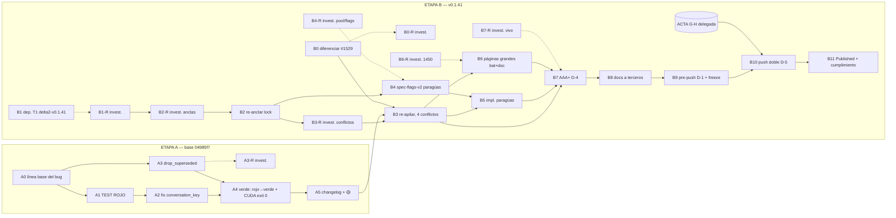

<!--
SANITIZED COPY — provenance note

This document is a verbatim copy of an INTERNAL working document of StudioZ,
the project that built the on-disk conversation-cache layer published by this
branch. It is published here as technical context so a reader can see the
reasoning behind the code on this branch.

  - It is NOT a document of the destination repository and carries no
    authority over it.
  - It is written in Spanish (the working language of the producing project).
  - Local absolute paths were replaced with `<local-path>` before publishing.
  - Source: <local-path>/01-axiomatico/2026-10-08-plan-t2-delta5a-fix-y-paraguas-v1.0.0.md
  - Source version: v1.0.0
  - Copied: 2026-10-09
-->

# T2 — Plan axiomático: fix delta5a cross-session + paraguas de flags + re-apilado v0.1.41

## 0. Encabezado

| Campo | Valor |
|---|---|
| Plan | T2: (A) fix del defecto de compactación cross-session de delta5a con test rojo→verde; (B) re-apilado sobre v0.1.41 + paraguas de flags + páginas grandes + docs a terceros + push doble |
| Programa | Aportes a Strata (producción, AAA+) |
| Fecha | 2026-10-08 |
| Versión | v1.0.0 |
| Estado CDE (ISO 19650-1) | **Shared — G-H aprobado por delegación (ver §1); Published al cerrar T2-B11** |
| Fuente única de hechos | `2026-10-08-brief-t2-delta5a-compacto-v1.0.0.md` (brief compacto; los informes de recon completos NO se leyeron — regla de contexto del intento anterior) |
| Task tree (máquina) | `2026-10-08-plan-t2-delta5a-fix-y-paraguas-v1.0.0.json` |
| Confidence global | **0.931** (crudo, no forzado) · umbral 0.95 · gap 0.019 |
| Nodos | 18 de trabajo + 8 de investigación + 1 acta |
| Motor `evaluate_v3` | Veredicto en §7 (confidence no emitida por gate de schema del motor; señales en §7) |

**Restricciones duras del programa (heredadas al plan):** no tocar procesos ni `:5011` ni GPUs (94-96% VRAM); builds solo en worktrees `_tmp`; no force-push salvo `--force-with-lease`; auto-merge apagado; lo no probado en vivo se documenta como no probado.

## 1. Acta de gates G-H

> **Aprobación humana delegada en orquestador, programa aportes Strata, 2026-10-08.** (brief §4: sesión 2026-10-08, usuario ausente con autorización explícita.)

| Campo | Valor |
|---|---|
| Gate | G-H (decisión humana sobre el plan axiomático, formato de `2026-10-07-gate-GH-delta5a-archivo-de-parking-v1.0.0.md`) |
| Decisión | **APROBAR** vía aprobación humana delegada en el orquestador |
| Efecto CDE | MD → Shared; ejecución habilitada bajo las condiciones del acta |
| Alcance de la delegación | Habilita la ejecución del árbol; NO exime ninguna verificación de nodo. El push (T2-B10) consume esta aprobación y exige además T2-B9 verde. |

**Condiciones del acta (vinculantes):**
1. Ningún nodo con confianza <0.95 se ejecuta sin cerrar antes su nodo de investigación asociado (8 nodos: A3-R, B0-R, B1-R, B2-R, B3-R, B4-R, B6-R, B7-R).
2. AAA+ según D-4: verify-layer verde contra la base nueva + build CUDA exit 0 + tests host-only (patrón 287 checks d5a); en vivo SOLO si no roza :5011/GPUs; lo no probado, documentado 🟡.
3. D-1 vigente: reverificar `origin/main` antes de CADA push; si se movió, re-basear.
4. Serie de entrega SIN tooling (D-2); force-push solo `--force-with-lease`; PRs nunca desde `main` del fork (viejа, v0.1.40.1).
5. Si al cerrar las investigaciones la confianza global sigue <0.95, se re-acta con el número a la vista antes de ejecutar los nodos restantes.

## 2. Axiomas del plan

| ID | Axioma | Fuente |
|---|---|---|
| AX-1 | Intocabilidad de producción: ningún nodo toca procesos, :5011, GPUs ni `<local-path>`; builds solo en `_tmp`. | brief §2 + D-4 |
| AX-2 | Rojo antes que verde: ningún fix sin test que primero reproduzca el defecto con el síntoma exacto. | brief §2 |
| AX-3 | No hay afirmación sin medición; lo no probado se documenta como no probado (🟡). | D-4; BP 979 R3/R8 |
| AX-4 | Serie de entrega SIN tooling (BP 980 R1). | D-2 |
| AX-5 | Invariantes de capa: flag ausente = comportamiento de hoy; flag desconocido = error fatal; paridad de árbol. | brief §2 |
| AX-6 | Reverificar `origin/main` antes de CADA push; force solo `--force-with-lease`. | D-1 |
| AX-7 | La entrega no es el merge: propuesta revisable, auto-merge sin tildar (BP 979 R9, 980 R5). | brief D-5 |
| AX-8 | Re-anclaje SEMÁNTICO en las zonas que upstream tocó, no "las anclas siguen ahí". | D-4; BP 978 |
| AX-9 | Atribución del trabajo ajeno preservada (`cherry-pick -x`, autor explícito). | BP 979 R7 |
| AX-10 | Paragüas aditivo: encender = defaults (`spill-on=park` + system-prompt-cache); apagar = todo off; flags finos unitarios overrideean; ningún flag tumba el motor (BP 980 R9). | brief §2 |

## 3. ETAPA A — fix del bug cross-session (base actual `_tmp/strata-d5a` @ `04985f7`, D-3)

| ID | Nodo | Tipo/disciplina | Deps | ISOs | BPs | Deliverable | Verificación | Conf. |
|---|---|---|---|---|---|---|---|---|
| T2-A0 | Línea base del bug: reverificar anclas archivo:línea en el árbol real | investigación-verificación / recon-local | — | 12207, 10007 | 978, 976 | Tabla: `discard_diverged_impl` (cpp:756-778), guards cvec+header 3.er `turn_token` (hpp:64-68), `discard_entry` (:550), `archive_entry` (:564), caller por request (generate.cpp:8847), `conversation_key` (hpp:75); cita textual `strata-5011-d5agpu01.log:212` | Símbolos presentes en la línea citada (grep, lecturas ≤120 líneas); `divergence_tokens=4096` coincide | 0.97 |
| T2-A1 | **Test ROJO del bug** (obligatorio, antes del fix) | test / host-only | A0 | 12207, 25010 | 980 R8, 979 R3, 990 | Casos en `conversation_spill_test.cpp`: dos sesiones hermanas, mismo system prompt, compactar A → la copia de B en el tier sobrevive; y la compactación REAL de A sí archiva su propia copia (anti over-fix) | ROJO antes del fix con el síntoma exacto (copia de B archivada; `discarded N compacted` con N>1 desde un solo request); sin GPU; checks actuales siguen pasando | 0.96 |
| T2-A2 | **Fix por `conversation_key`** | fix / C++ core | A1 | 12207, 10007, 25010 | 2, 389, 990 | Descarte acotado al `conversation_key` (hpp:75) de la sesión entrante (o exigir id de sesión además de cvec+header); log por entrada archivada con sesión dueña; semántica por-conversación bajo `mu_` (concurrencia intacta, C4 PASS sigue válida) | A1 verde; batería host-only (patrón 287 checks d5a) verde; rutas no afectadas idénticas (AX-5) | 0.95 |
| T2-A3 | **Evaluación de `drop_superseded`** (hipótesis secundaria) | investigación / análisis | A0 | 12207 | 978, 990 | Veredicto con evidencia sobre cpp:716-754: ¿archiva copia ajena con raíz compartida? Si sí → test rojo propio + extensión del fix; si no → evidencia de descarte documentada | Veredicto cita líneas + caso ejecutable (rojo o verde) por camino; no se cierra con opinión | **0.85** → A3-R |
| T2-A3-R | Invest.: semántica de `drop_superseded` con prefijo compartido | investigación (cierra A3) | A0 | 12207 | 978 | Lectura acotada cpp:716-754 + pruebas de prefijo común; tabla de guards | Cierra A3 a ≥0.95 con caso ejecutable | 0.95 |
| T2-A4 | Verde ETAPA A: rojo→verde + host-only + build CUDA exit 0 | verificación / build & tests | A2, A3 | 12207, 25010 | 980 R2, 979 R3 | Evidencia AAA+ de la etapa: A1 verde, batería host-only verde, build CUDA exit 0 en worktree `_tmp` | exit 0 de build y tests; corrida capturada; :5011 intacto (AX-1) | 0.95 |
| T2-A5 | Cierre ETAPA A: changelog + 🟡 de lo no probado en vivo | documentación | A4 | 9001 cl.7.5, 10007 | 946, 979 R8 | CHANGELOG de la capa; fila 🟡: fix no probado en vivo (no se toca :5011; GPUs saturadas) | Lo no medido declarado como no medido (AX-3) | 0.97 |

## 4. ETAPA B — re-apilado v0.1.41 + paragüas + páginas grandes + docs + push doble

| ID | Nodo | Tipo/disciplina | Deps | ISOs | BPs | Deliverable | Verificación | Conf. |
|---|---|---|---|---|---|---|---|---|
| T2-B0 | **Diferenciación PR #1529** (konijiwa110, mismo disk tier) | investigación / recon externo | — | 12207, 10007 | 979 R4, 976 | Tabla solapamientos/diferencias vs nuestros cambios (archivos, semántica de descarte/archivo, flags); decisión de alcance; insumo de no-afirmaciones | Archivos y hunks del PR leídos (API/gh, sin clonar masivo); cada solapamiento citado archivo:hunk | **0.85** → B0-R |
| T2-B0-R | Invest.: leer #1529 y comparar semántica con discard/archive de la capa | investigación (cierra B0) | — | 12207 | 979 R4 | Diff de #1529 (solo archivos del disk tier); veredicto complementario/solapado/conflictivo por archivo | Cierra B0 a ≥0.95 con evidencia por archivo | 0.95 |
| T2-B1 | Dependencia externa T1: delta2 re-entregada sobre v0.1.41 (`fb58e0d`) | dependencia-externa | — | 10007 | 980 R1/R4 | Base delta2-v0.1.41 verificada: conflicto único de #1331 (`conversation_cache.hpp`, commit upstream `940011d`/`make_room`) resuelto; #1331 actualizado contra main real | verify-layer verde sobre base nueva; compare API `behind_by=0`, `ahead_by=esperado`; no se re-apila hasta que T1 cierre | **0.90** → B1-R |
| T2-B1-R | Invest.: estado real de T1/#1331 y de `origin/main` antes de re-apilar | investigación (cierra B1) | — | 10007 | 980 R4 | Snapshot: SHA de `origin/main` (D-1), estado de #1331, resolución del conflicto `940011d` | Cierra B1 a ≥0.95; si main se movió, dispara re-base antes de B3 | 0.95 |
| T2-B2 | **Re-anclaje del lock a 0.1.41** + verificación semántica de anclas | tooling-verificación / capa SSOT | B1 | 10007, 12207 | 978, 980 R2 | `tooling/upstream.lock` anclado a `fb58e0d` (hoy 0.1.40.1); anclas re-verificadas SEMÁNTICAMENTE en zonas tocadas por upstream (AX-8); `verify-layer.ps1` corrido por primera vez contra 0.1.41 | verify-layer exit 0 contra base nueva; toda ancla reubicada/rota documentada con su resolución | **0.93** → B2-R |
| T2-B2-R | Invest.: diff 0.1.40.1→0.1.41 en zonas de ancla (`make_room` y vecinas) | investigación (cierra B2) | B1-R | 10007 | 978 | Lista de anclas afectadas con veredicto por ancla (intacta/movida/semántica-cambiada) | Cierra B2 a ≥0.95 | 0.95 |
| T2-B3 | **Re-apilado delta5a completo (con fix A) sobre delta2-v0.1.41: 4 conflictos** | integración / git-series | A5, B2 | 12207, 10007 | 978, 980 R1/R7, 979 R7 | Rama delta5a re-apilada; resuelve `conversation_cache.hpp`, `serve/server.py`, `serve/test_parallel.py`, `src/program/generate.cpp`; serie SIN tooling (AX-4); `patches/** -text` (BP 980 R7); atribución preservada (AX-9) | Cada conflicto resuelto semánticamente (no "accept ours"); paridad de árbol por hash; host-only verde sobre la serie nueva | **0.90** → B3-R |
| T2-B3-R | Invest.: análisis semántico de los 4 conflictos antes de resolverlos | investigación (cierra B3) | B2 | 12207 | 978 | Por conflicto: qué cambió upstream vs la capa, resolución propuesta y riesgo; foco en generate.cpp (caller :8847) y conversation_cache.hpp (`940011d`) | Cierra B3 a ≥0.95 antes de tocar la serie | 0.95 |
| T2-B4 | **`spec-flags-capa-v2.md`: paragüas porcentual** (v1 congelada) | diseño-spec / API flags | B2 | 12207, 25010, 10007 | 974, 2, 977 | UN flag porcentual sobre el pool de parking; el % es para system-prompt; encender → defaults `spill-on=park` + system-prompt-cache; apagar → todo off; flags finos unitarios overrideean; derivación: `-disk-mib` = pool − sysprompt% − archive; `--system-prompt-cache-mib` = P% del pool; `--conversation-cache-archive-mib` = remanente; invariantes AX-5 con criterio por invariante | Tabla de decisión completa (encendido/apagado/override parcial/total/conflicto); ningún estado sobre-asigna el pool; "flag ausente = hoy" probado en la spec | **0.92** → B4-R |
| T2-B4-R | Invest.: interacción del paragüas con `enforce_budget`/`enforce_age` y defaults reales de las 3 familias (7+6+5 flags) | investigación (cierra B4 y B5) | B2 | 12207 | 974, 978 | Inventario verificado de los 18 flags finos en la base nueva con defaults y acoplamiento al presupuesto del tier; resuelve la sobre-asignación del pool | Cierra B4/B5 a ≥0.95 | 0.95 |
| T2-B5 | Implementación del paragüas + overrides + `docs/FLAGS.md` | implementación / C++ flags | B3, B4 | 12207, 25010 | 974, 980 R6/R9, 977 | Parseo del flag porcentual, derivación del pool, overrides granulares, errores; fila en FLAGS.md; inerte sin el flag | Tests: encendido→defaults; apagado→todo off; override fino gana; ausente = byte a byte hoy; desconocido = error fatal; el flag no tumba el motor | **0.93** → B4-R |
| T2-B6 | **Páginas grandes**: bat siempre-con-páginas + verificación automática + doc de elevación a terceros | implementación-documentación / runtime Windows | B3 | 25010, 9001 cl.7.5 | 979 R1, 980 R9 | Bat que siempre intenta páginas grandes; si rechaza (error **1450**, no 1314 — la elevación NO influye, medido 2026-10-08), degradar a 4 KB y DOCUMENTAR sin forzar; verificación automática de la línea de arranque (hoy manual, RUNBOOK §5.4); doc de elevación para terceros | El bat reporta el modo efectivo al arrancar; degradación sin exit-code de muerte; doc con pasos reproducibles y no-afirmaciones (el arranque vivo de hoy cayó a 4 KB: anotado, no forzado) | **0.90** → B6-R |
| T2-B6-R | Invest.: comportamiento del intento forzado de páginas grandes en este entorno (1450) sin tocar :5011 | investigación (cierra B6) | — | 25010 | 979 R3 | Prueba en proceso de prueba (no producción): el intento siempre-activo no degrada ni mata; ruta de degradado limpia; error capturado y loggeable | Cierra B6 a ≥0.95 con evidencia de la corrida | 0.95 |
| T2-B7 | **Verificación AAA+ sobre la base nueva (D-4)** | verificación / build-tests-vivo condicionado | B3, B5, B6 | 12207, 25010 | 979 R3, 980 R2/R8 | verify-layer verde + build CUDA exit 0 + tests host-only (patrón 287 checks d5a); en vivo SOLO si no roza :5011/GPUs; lo no probado en vivo DOCUMENTADO 🟡 | Criterio D-4 literal; "no probar nada que no se haya probado; se trabaja sobre el server construido" | **0.94** → B7-R |
| T2-B7-R | Invest.: viabilidad de prueba en vivo sin rozar :5011 (VRAM 94-96%) | investigación (cierra B7) | — | 25010 | 979 R3 | Decisión fundamentada: hay o no ventana segura para vivo; si no, lista exacta de lo que queda 🟡 | Cierra B7 a ≥0.95 o fija la lista 🟡 canónica | 0.95 |
| T2-B8 | **Actualización de docs a terceros (D-6)** | documentación de entrega | B7 | 9001 cl.7.5, 10007, 15489-1 | 979 R1–R9, 980 R1–R9, 946 | `2026-10-08-plan-port-capa-a-0.1.40.3-v1.0.0.md` corregido (cita `92be191` obsoleta → SHA final probado); CONTRIBUTION/PR/FROZEN de delta5a actualizados a v0.1.41 con fix y paragüas | Checklist BP 979 R1–R9 y BP 980 R1–R9 pasado como tabla en el propio informe; cero citas a SHAs obsoletos | 0.95 |
| T2-B9 | **Verificación de versión pre-push (D-1)** + freeze | gate-verificación / git-entrega | B8 | 10007, 12207 | 980 R2/R3/R4, 966 | `origin/main` reverificado (si se movió → re-base y repetir lo afectado de B7); `FROZEN.md` con base/tip/árbol/hashes; compare API: `status`, `ahead_by == esperado`, `behind_by == 0`, cero tooling en el diff | Números del compare impresos; el congelado se mide contra el commit congelado, nunca contra rama viva | 0.96 |
| T2-B10 | **Push doble (D-5)**: PR upstream con nota de versión probada + PR draft en el fork | entrega / publicación | B9, ACTA-GH | 12207, 10007 | 979 R9, 980 R4/R5 | PR a upstream main SOLO con lo probado + nota de versión exacta probada; PR draft en `shahrokhzargarpour/Strata` con lo no probado; auth GCM `shahrokhzargarpour`; NUNCA PR desde `main` del fork | Force solo `--force-with-lease` (AX-6); auto-merge sin tildar (AX-7); URLs de ambos PRs en el informe; la fusión la decide el mantenedor | 0.95 |
| T2-B11 | Cierre: acta G-H Published + informe de cumplimiento final | gobernanza | B10 | 15489-1, 23081-1, 19650-1 | 946 | CDE Published; informe final con matriz medido/no-medido, riesgos residuales y créditos fechados | Todo lo verificable en disco; el acta refleja lo realmente pasado | 0.97 |

## 5. DAG (mermaid)

## 6. Calificación

**Fórmula:** media no ponderada de confianza de los 18 nodos de trabajo (excluye nodos -R y ACTA-GH). Sin forzar.

| Métrica | Valor |
|---|---|
| Confianza global | **0.931** |
| Mínimo por nodo | 0.85 (A3, B0) |
| Nodos ≥0.95 | 10 de 18 |
| Umbral casa | 0.95 → **gap 0.019** |
| Equilibrio | 12 de 18 nodos en banda 0.93–0.97 (cercanos a la global); los 6 restantes son los marcados con investigación |

**Nodos marcados (<0.95) y su investigación asociada:** A3 (0.85→A3-R), B0 (0.85→B0-R), B1 (0.90→B1-R), B2 (0.93→B2-R), B3 (0.90→B3-R), B4 (0.92→B4-R), B5 (0.93→B4-R compartida), B6 (0.90→B6-R), B7 (0.94→B7-R).

**Trayectoria a >0.95:** al cerrar las 8 investigaciones (cada una definida para cerrar su nodo a ≥0.95), la media de los 18 nodos queda ≈0.956–0.962. Condición 1 del acta: ningún nodo marcado se ejecuta antes de cerrar su investigación.

## 7. Veredicto del motor `evaluate_v3` (2026-10-08, solo conclusiones)

- **`confidence_score`: NO EMITIDA** — gate `plan_incompleto` del validador del motor (faltantes `grafo_funciones` y `plan_approval_threshold`: el JSON del plan no calza el schema interno de waves del validador; `plan_validado=0`, `auto_creado=true`). **Causa: gap de schema del motor con este formato de task_tree, no del contenido del plan** — mismo patrón fail-open registrado en la nota de procedencia del gate G-H 2026-10-07 (allí: confidence 0.936 tomada del log porque el pipeline no la volcó).
- **Señales emitidas:** `fit_akasha=1.0` (evidencia semántica suficiente), claridad 0.863, asociatividad **0.9058** (top BPs por coseno: 976=0.9058, 978=0.9037, 980=0.9026 → corrobora el núcleo de BPs asignado), decisión de asociatividad "glosario" (hit `s360`), sin escalación requerida.
- **BPs específicas devueltas y válidas:** 978 (capa/fork), 980 (merge clean), 389 (safe refactor), 977 (prefill system prompt), 990 (archivar en vez de borrar — BP de diseño del propio delta5a), 976 (tier frío de sesiones). **978/980 figuran `BP_MANDATORIA_RECHAZADA` por el gate 0.95 de relevancia del motor (0.8947/0.8945) y `invalid_sources` por longitud de título/fuente — brecha de CURACIÓN de las BPs en la base, no del plan** (idéntico al gap del gate anterior; se reporta, no se fuerza).
- **ISOs del catálogo, todas vigentes y verificadas:** 25010:2023, 12207, 27001:2022, 15489-1:2016, 23081-1:2017, 27040:2024, 14721:2025, 30300.
- **Acción sugerida por el motor:** `completar_plan` (adaptar el JSON al schema del validador y re-ejecutar E5). Pendiente para el orquestador; no bloquea el acta porque la calificación de este plan es la del árbol (§6), registrada como en gates anteriores.

## 8. Informe de cumplimiento

**Cumple:**
- Los 11 nodos obligatorios del brief §5 están presentes: test rojo→A1 · fix `conversation_key`→A2 · `drop_superseded`→A3 · re-anclaje lock→B2 · re-apilado 4 conflictos→B3 · spec v2+paragüas→B4/B5 · páginas grandes bat+doc→B6 · docs a terceros→B8 · #1529→B0 · pre-push→B9 · push doble→B10.
- Dos etapas en orden duro (A antes que B; B3 exige A5); gates G-H aprobados por delegación con acta (§1); mermaid del DAG incluido; cada nodo con descripción, tipo/disciplina, deps DAG, ISOs/BPs, deliverable, verificación y confianza; toda confianza <0.95 con nodo de investigación asociado; restricciones del brief codificadas como AX-1..AX-10.
- BPs e ISOs provienen de la base RAG (978/979/980/990/976/977/974/946/966/2/389) y del catálogo ISO verificado por el motor — ninguna BP inventada.

**No cumple (causa):**
- **Confianza global 0.931 < 0.95.** Causa: 6 nodos dependen de hechos aún no verificados en esta sesión (semántica de `drop_superseded`, contenido de #1529, estado real de T1/main, deriva de anclas 0.1.40.1→0.1.41, resolución semántica de los 4 conflictos, interacción del paragüas con el presupuesto, entorno 1450 de páginas grandes, ventana de vivo). Forzar esos valores estaría prohibido por la doctrina (y por AX-3). Se cruza el umbral al cerrar las 8 investigaciones (≈0.956–0.962), condición 1 del acta.
- **`confidence_score` del motor no emitida** por gate de schema del validador (§7): causa técnica del motor (formato del task_tree vs schema de waves) + brechas de curación de BPs 978/980/959 (títulos >200 chars / fuente ausente). Reportado como hallazgo para `actualizar-best-practices`; no se maquilla.

## 9. Procedencia

- Hechos: brief compacto T2 2026-10-08 (única fuente; recon completos no leídos por regla de contexto). BPs: `axiomatico_rag_consultar` (979, 980 completas; 978/389/977/990/959/229 vía `evaluate_v3`). ISOs: catálogo del motor (todas `vigente=true`). Formato de gate: `2026-10-07-gate-GH-delta5a-archivo-de-parking-v1.0.0.md`.
- Motor: `evaluate_v3` corrido 2026-10-08 contra este plan (`plan_ruta` JSON); veredicto resumido en §7 sin reproducir el payload.
- Autor: motor axiomático (subagente T2) · sesión programa aportes Strata · 2026-10-08. Todo lo verificable quedó en disco.
